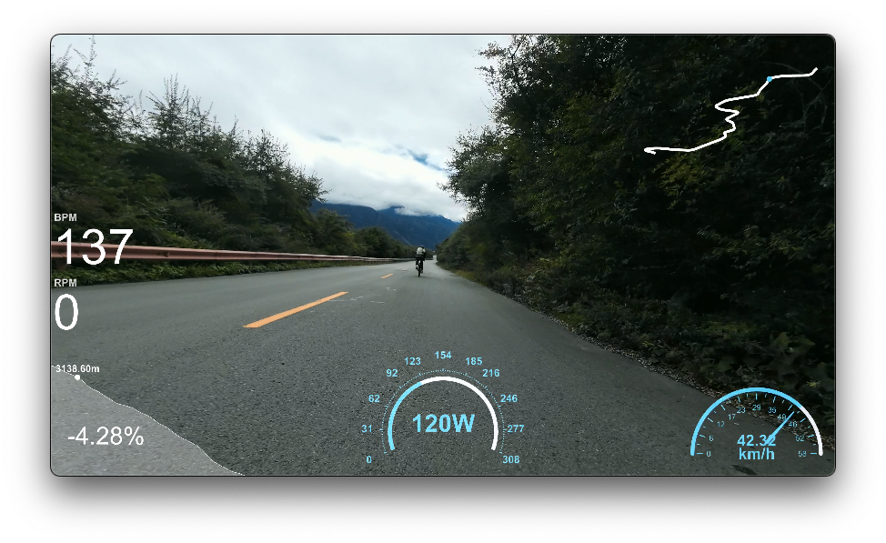
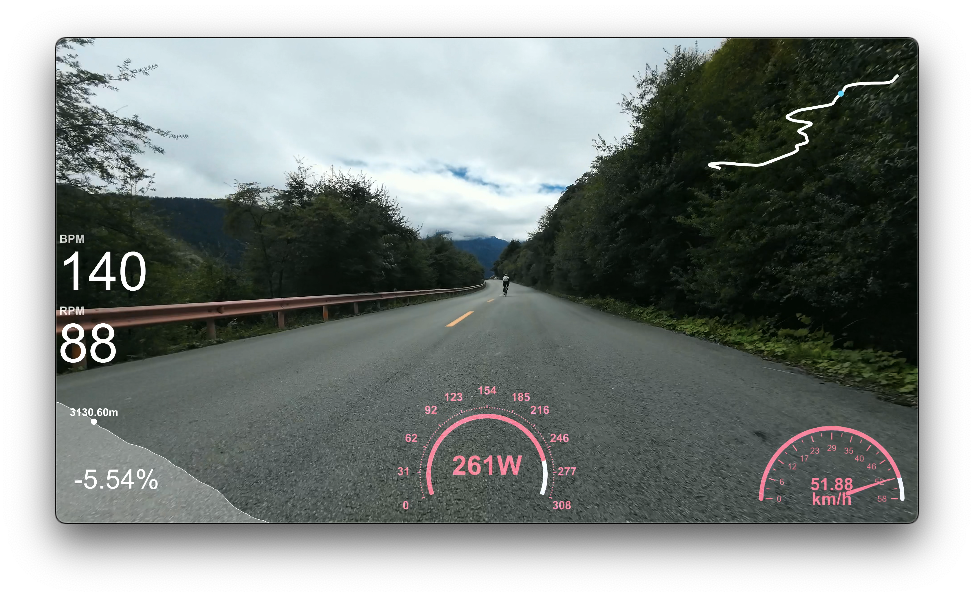

# fit-overlay-cli

[中文](./README_zh.md)

`fit-overlay-cli` is a tool that can export fit data into overlay video.



## Features

- Use [echarts](https://github.com/apache/echarts)，support custom charts. For more chart styles, please see：[echarts examples](https://echarts.apache.org/examples/en/index.html)
- It supports custom data and the use of Java Script to control the state of each frame. Display the picture shown above as normal, when the power or speed is greater than 80% of the maximum value, it is displayed as：
  

This code `set_option.js`：
```javascript
powerColor = ${power} > (maxPower * 0.8) ? 'rgb(255, 70, 131)' : '#58D9F9';
speedColor = ${speed} > (maxSpeed * 0.8) ? 'rgb(255, 70, 131)' : '#58D9F9';
```
- Use [FFmpeg](https://github.com/FFmpeg/FFmpeg)，support hardware accelerated export，use command `./fit-overlay-cli ffmpeg --args -encoders`see more.

## Installation

Download [fit-overlay-cli](https://github.com/zzyandzzy/fit-overlay-cli/releases) and unzip the binary file of the corresponding computer。

## Usage

1. First install [FFmpeg](https://github.com/FFmpeg/FFmpeg) or run this command.

```shell
# This command will first download and unzip FFmpeg to the current folder.
./fit-overlay-cli ffmpeg --args -version
```

2. Run.

```shell
# Generate a video with a timestamp greater than or equal to 1696483082 to 1696483112(1696483082+30) seconds according to tests.fit
# The --delay parameter indicates that the time difference between the data recorded by fit and the video recording is 17 seconds.
./fit-overlay-cli gen --fit-path ./tests/tests.fit --start-timestamp 1696483082 --delay -17 --duration 30 --codec h264

# View supported hardware coding accelerators
./fit-overlay-cli ffmpeg --args -encoders | grep h264
Apple M2 output:
 V....D h264_videotoolbox    VideoToolbox H.264 Encoder (codec h264)

# So you can use the h264_videotoolbox hardware accelerator
./fit-overlay-cli gen --fit-path ./tests/tests.fit --start-timestamp 1696483082 --delay -17 --duration 30 --codec h264_videotoolbox
# or hevc(h265)
./fit-overlay-cli gen --fit-path ./tests/tests.fit --start-timestamp 1696483082 --delay -17 --duration 30 --codec hevc_videotoolbox

# For more details of the order, please check
./fit-overlay-cli --help
```


## License

`fit-overlay-cli` is released under the MIT License.

```text
MIT License

Copyright (c) 2020 intent

Permission is hereby granted, free of charge, to any person obtaining a copy
of this software and associated documentation files (the "Software"), to deal
in the Software without restriction, including without limitation the rights
to use, copy, modify, merge, publish, distribute, sublicense, and/or sell
copies of the Software, and to permit persons to whom the Software is
furnished to do so, subject to the following conditions:

The above copyright notice and this permission notice shall be included in all
copies or substantial portions of the Software.

THE SOFTWARE IS PROVIDED "AS IS", WITHOUT WARRANTY OF ANY KIND, EXPRESS OR
IMPLIED, INCLUDING BUT NOT LIMITED TO THE WARRANTIES OF MERCHANTABILITY,
FITNESS FOR A PARTICULAR PURPOSE AND NONINFRINGEMENT. IN NO EVENT SHALL THE
AUTHORS OR COPYRIGHT HOLDERS BE LIABLE FOR ANY CLAIM, DAMAGES OR OTHER
LIABILITY, WHETHER IN AN ACTION OF CONTRACT, TORT OR OTHERWISE, ARISING FROM,
OUT OF OR IN CONNECTION WITH THE SOFTWARE OR THE USE OR OTHER DEALINGS IN THE
SOFTWARE.
```

## Acknowledgments

- [FFmpeg](https://github.com/FFmpeg/FFmpeg)
- [charming](https://github.com/yuankunzhang/charming)
- [echarts](https://github.com/apache/echarts)

